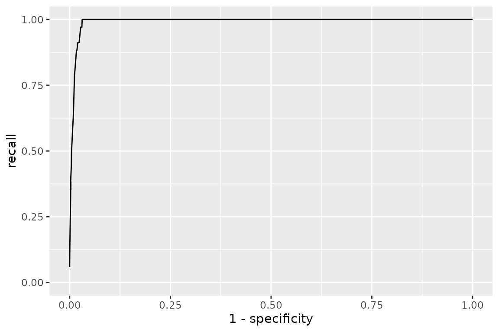

# Running and fitting models on naturalistic corpora

Most of `XSLmodels` is built around *controlled* cross-situational
learning experiments: a handful of words and objects, a designed
training order, and a vector of human accuracies to fit with
sum-of-squared-error. This vignette is about the other kind of input –
**naturalistic corpora** of caregiver speech paired with the objects
present in the scene. There is no human referent-selection data to fit;
instead we ask how well a model’s learned word–object matrix recovers a
**gold-standard lexicon**.

Two such corpora ship with the package, imported from the
[wurwur](https://github.com/mcfrank/wurwur) package:

``` r

rollins_corpus$data
#> xslData object with label "Rollins" and condition "CHILDES naturalistic corpus (Frank, Goodman & Tenenbaum, 2009)"
#>   training trials: 619
#>       test trials: 0
#>             words: 416
#>           objects: 22
#>        accuracies: 0
fm_corpus$data
#> xslData object with label "FM" and condition "Frank, Tenenbaum & Fernald naturalistic corpus"
#>   training trials: 4763
#>       test trials: 0
#>             words: 1122
#>           objects: 30
#>        accuracies: 0
```

- **`rollins_corpus`** – 619 mother-to-infant utterances from the
  Rollins corpus in CHILDES; the corpus the intentional Bayesian model
  of Frank, Goodman & Tenenbaum (2009) was originally fit to.
- **`fm_corpus`** – the larger Frank, Tenenbaum & Fernald corpus: 4763
  utterances, and (unlike Rollins) the speaker’s referential intention
  is hand-coded for each utterance.

Each is a list, not a bare `xslData`:

``` r

names(rollins_corpus)
#> [1] "data"      "gold"      "reference"
names(fm_corpus)
#> [1] "data"          "intents"       "gold"          "gold_variants"
#> [5] "reference"
```

`$data` is the training `xslData`; `$gold` is the reference lexicon.
Note that words and objects here are the actual strings, not integer
ids:

``` r

rollins_corpus$data$train$words[[1]]
#> [1] "ahhah" "look"  "we"    "can"   "read"  "books" "david"
rollins_corpus$data$train$objects[[1]]
#> [1] "book"   "bird"   "rattle" "face"
str(rollins_corpus$gold)
#> List of 2
#>  $ words  : chr [1:34] "baby" "bear" "bigbird" "bigbirds" ...
#>  $ objects: chr [1:34] "baby" "bear" "bird" "bird" ...
```

## Running a model

[`xsl_run()`](https://www.kachergis.com/XSLmodels/reference/xsl_run.md)
works exactly as it does for experimental conditions – it returns a
fitted object whose `matrix` is the learned word (rows) by object
(columns) association matrix.

``` r

res <- suppressWarnings(xsl_run(baseline(), rollins_corpus$data))
m <- res$fits[[1]]$matrix
dim(m)
#> [1] 416  22

# co-occurrence counts for one word (this corpus is a picture-book session,
# so the objects are animals and toys -- "moocow", "piggie", etc.)
sort(m["moocow", ], decreasing = TRUE)[1:4]
#>    cow    pig rattle   book 
#>      8      3      3      1
```

Two things to know:

- **Ignore `res$sse` and `res$fits[[1]]$perf`.** Those compare against
  `data$accuracy`, which is empty for a corpus.
  [`xsl_run()`](https://www.kachergis.com/XSLmodels/reference/xsl_run.md)
  still computes them (falling back to
  [`get_perf()`](https://www.kachergis.com/XSLmodels/reference/get_perf.md)),
  which is where the
  `"longer object length is not a multiple of shorter"` warning above
  comes from – the matrix is not square. It is harmless here; we score
  against the gold lexicon instead.
- The batch model
  [`fgt2009()`](https://www.kachergis.com/XSLmodels/reference/fgt2009.md)
  (below) does joint inference over the whole corpus and has no learning
  trajectory, so `control$reps` does nothing for it.

## Scoring against the gold lexicon

The evaluation helpers take a `gold_lexicon = list(words, objects)`.
Because a model’s matrix is real-valued, the score depends on a
**threshold** for counting an edge as “learned”. \[get_fscore()\] scores
one threshold:

``` r

get_fscore(m / rowSums(m), threshold = 0.1, gold_lexicon = rollins_corpus$gold)
#> # A tibble: 1 × 5
#>   threshold precision recall fscore specificity
#>       <dbl>     <dbl>  <dbl>  <dbl>       <dbl>
#> 1       0.1     0.143  0.912  0.247       0.977
```

\[get_roc()\] sweeps thresholds (row-normalizing the matrix first), and
\[get_roc_max()\] returns the best F-score over that sweep – the
standard single-number summary:

``` r

roc <- get_roc(m, gold_lexicon = rollins_corpus$gold)
head(roc, 3)
#> # A tibble: 3 × 5
#>   threshold precision recall fscore specificity
#>       <dbl>     <dbl>  <dbl>  <dbl>       <dbl>
#> 1      0       0.0294      1 0.0571       0    
#> 2      0.01    0.116       1 0.207        0.966
#> 3      0.02    0.118       1 0.212        0.967

get_roc_max(m, gold_lexicon = rollins_corpus$gold)
#> [1] 0.3768116
plot_roc(m, gold_lexicon = rollins_corpus$gold)
```



Comparing a few associative models on Rollins:

``` r

assoc_models <- list(
  baseline        = baseline(),
  decay           = decay(C = 0.99),
  rescorla_wagner = rescorla_wagner(C = 1, alpha = 0.1, beta = 0.1, lambda = 1),
  fazly           = fazly(lambda = 1e-5, beta = 8500)
)

sapply(assoc_models, function(mod) {
  mm <- suppressWarnings(xsl_run(mod, rollins_corpus$data)$fits[[1]]$matrix)
  round(get_roc_max(mm, gold_lexicon = rollins_corpus$gold), 3)
})
#>        baseline           decay rescorla_wagner           fazly 
#>           0.377           0.343           0.378           0.450
```

## The intentional Bayesian model

[`fgt2009()`](https://www.kachergis.com/XSLmodels/reference/fgt2009.md)
is the model built for exactly this problem: it does joint posterior
inference over a word–object lexicon for the whole corpus at once,
marginalizing the speaker’s referential intention on each utterance. It
is a **batch** MCMC model, so a single run takes seconds to a minute or
two on these corpora (much slower than the associative tallies) and
`xslFit$matrix` holds posterior edge marginals
`P(word names object | corpus)`.

**The `gamma` parameter matters here.** `gamma` is the probability a
word is used *referentially*. In a controlled experiment every word is a
label, so the default is `gamma = 1`. Naturalistic speech is full of
non-referential words (“the”, “look”, “you”, “see”), so a corpus wants
the published `gamma = 0.1`, `kappa = 0.05` – otherwise the model is
forced to explain every function word as naming something and learns
almost nothing.

``` r

res <- xsl_run(
  fgt2009(alpha = 3, gamma = 0.1, kappa = 0.05),
  rollins_corpus$data
)
m_fgt <- res$fits[[1]]$matrix

# the learned lexicon: edges with posterior probability > 0.5
edges <- which(m_fgt > 0.5, arr.ind = TRUE)
data.frame(word   = rownames(m_fgt)[edges[, 1]],
           object = colnames(m_fgt)[edges[, 2]],
           prob   = round(m_fgt[edges], 2))
#>       word object prob
#> 1     bear   bear 1.00     # correct
#> 2   bottle   bear 1.00     # "baby bottle" co-occurs with the bear
#> 3  bigbird   bird 1.00     # correct
#> 4     book   book 1.00     # correct
#> 5   moocow    cow 1.00     # correct
#> 6      hat    hat 1.00     # correct
#> 7     oink    pig 1.00     # correct
#> ...                        # 28 edges total

get_roc_max(m_fgt, gold_lexicon = rollins_corpus$gold)
#> [1] 0.454   # MCMC: expect a little run-to-run variation
```

## “Fitting”: sweeping the lexicon-size prior

[`fgt2009()`](https://www.kachergis.com/XSLmodels/reference/fgt2009.md)’s
`alpha` penalizes lexicon size (`P(L)` proportional to
`exp(-alpha * |L|)`) and has to scale with corpus size: too small gives
a diffuse over-large lexicon, too large an empty one. The F-vs-`alpha`
curve is single-peaked, so the right way to “fit” the model to a corpus
is a coarse sweep – which is what \[fgt2009_sweep_alpha()\] does. Pass
`gold` and it reports the best-threshold F-score at each `alpha`:

``` r

sweep <- fgt2009_sweep_alpha(
  rollins_corpus$data,
  alphas = c(2, 4, 6, 9, 14),
  gold   = rollins_corpus$gold,
  gamma = 0.1, kappa = 0.05,
  n_warmup = 50, n_samples = 120      # a lighter sampler for the sweep
)
sweep
```


The curve rises to a shallow peak around `alpha = 2`–`4` and then falls
off as the prior forces the lexicon empty. Take the `alpha` near the
peak; that is the value to report, and the one to use for trial-by-trial
predictions (\[predict_referent()\]) or further analysis. On this small
corpus `fgt2009` is in the same range as the better associative models
(`fazly` above); its advantage is largest on data with more varied,
informative co-occurrence.

## The FM corpus and its coded intentions

`fm_corpus` is used the same way, but it is bigger and comes with extra
structure. `fm_corpus$intents[[t]]` is the object(s) the speaker
actually referred to on utterance `t` – empty for the roughly half of
utterances that are non-referential:

``` r

fm_corpus$data$train$words[[1]]
#> [1] "and"   "whats" "that"  "is"    "this"  "a"     "puppy" "dog"
fm_corpus$intents[[1]]
#> [1] "dog"

mean(lengths(fm_corpus$intents) == 0)   # fraction non-referential
#> [1] 0.5007348
```

It also ships three gold lexicons – a hand-curated one plus two
auto-derived from the coded intentions at different co-occurrence
thresholds:

``` r

lengths(lapply(list(curated    = fm_corpus$gold,
                    strict     = fm_corpus$gold_variants$strict,
                    permissive = fm_corpus$gold_variants$permissive),
               `[[`, "words"))
#>    curated     strict permissive 
#>         41         39        116
```

``` r

m_fm <- suppressWarnings(xsl_run(baseline(), fm_corpus$data)$fits[[1]]$matrix)

sapply(list(curated    = fm_corpus$gold,
            strict     = fm_corpus$gold_variants$strict,
            permissive = fm_corpus$gold_variants$permissive),
       function(g) round(get_roc_max(m_fm, gold_lexicon = g), 3))
#> Warning in max(fscores[!is.na(fscores)]): no non-missing arguments to max;
#> returning -Inf
#>    curated     strict permissive 
#>      0.268      0.191       -Inf
```

The permissive lexicon is larger and easier to hit some of, so absolute
F-scores are not comparable across the three – pick one and use it
consistently when comparing models.

## A quick model comparison

`tests/bakeoff_comparison/corpus_gold_comparison.R` runs every model
once on each corpus and scores the learned matrix against the corpus
gold lexicon. It is deliberately **not** a fitted bake-off: the
associative and sampling models use `xsl_model_registry()`’s starting
parameters (calibrated defaults, not re-fit here), and
[`fgt2009()`](https://www.kachergis.com/XSLmodels/reference/fgt2009.md)
uses `gamma = 0.1`, `kappa = 0.05` with `alpha` from the two-point
heuristic `round(7 * sqrt(n / 600))`.

| model              | Rollins |    FM |
|:-------------------|--------:|------:|
| bayesian_decay     |   0.449 | 0.450 |
| fazly              |   0.450 | 0.407 |
| fgt2009_rsa        |   0.395 | 0.421 |
| fgt2009            |   0.385 | 0.421 |
| uncfam_sampling    |   0.377 | 0.353 |
| multi_sampling     |   0.377 | 0.353 |
| uncfam_attention   |   0.371 | 0.354 |
| uncfam             |   0.371 | 0.353 |
| guess_and_test     |   0.409 | 0.297 |
| softmax_rl         |   0.407 | 0.258 |
| baseline           |   0.377 | 0.268 |
| rescorla_wagner    |   0.312 | 0.290 |
| decay              |   0.320 | 0.272 |
| propose_but_verify |   0.321 | 0.236 |
| kalman_filter      |   0.303 | 0.211 |
| pursuit            |   0.353 | 0.048 |
| uncfam_predictive  |   0.208 | 0.091 |
| tilles             |   0.080 | 0.048 |

Best-threshold F of the learned lexicon vs. the gold lexicon. {.table}

Reading the table:

- **`bayesian_decay` and `fazly` come out on top** (F around 0.45 on
  both corpora), with `fgt2009` close behind.
- **`fgt2009` trades recall for precision.** On FM its precision is
  ~0.71 against ~0.2–0.34 for the others: the geometric size prior makes
  it commit to a small, mostly-correct lexicon rather than a large noisy
  one. Whether that is the right tradeoff depends on what you want the
  lexicon for.
- The RSA layer makes no difference on FM (`fgt2009` == `fgt2009_rsa`):
  at `alpha = 20` the learned lexicon is sparse enough that no word
  names two co-present objects, so the pragmatic speaker reduces to the
  literal one.
- The middle of the pack is a tight cluster around F = 0.35 – the three
  `uncfam` variants and the two sampling versions all land there, which
  is reassuring since the sampling models are meant to approximate
  [`uncfam()`](https://www.kachergis.com/XSLmodels/reference/uncfam.md).
- **Every model now runs on both corpora**, but several needed fixes to
  get there. The sampling/RL models were built for controlled
  experiments of a few dozen trials; running them on 4763 naturalistic
  utterances exposed a memory blow-up
  ([`xslControl()`](https://www.kachergis.com/XSLmodels/reference/xslControl-class.md)’s
  `keep_traj = FALSE` default), an error on the many non-referential
  utterances with no objects present, and two latent bugs
  ([`softmax_rl()`](https://www.kachergis.com/XSLmodels/reference/softmax_rl.md)
  and
  [`guess_and_test()`](https://www.kachergis.com/XSLmodels/reference/guess_and_test.md)
  comparing a sampled guess to object *positions* vs *labels*;
  [`guess_and_test()`](https://www.kachergis.com/XSLmodels/reference/guess_and_test.md)
  also mishandling a word repeated within one utterance;
  [`tilles()`](https://www.kachergis.com/XSLmodels/reference/tilles.md)
  coercing its labels with
  [`as.integer()`](https://rdrr.io/r/base/integer.html) and returning an
  unnamed matrix). `pursuit` and `tilles` still learn near-empty or
  diffuse lexicons on FM at the registry’s default parameters – read the
  low scores as “this parameterisation doesn’t transfer”, not “the model
  is broken”.

### Fitting to a corpus

`tests/bakeoff_comparison/corpus_gold_fits.R` goes a step further: for
each model it runs a (parallel) DEoptim search over the model’s
parameters, maximizing the same best-threshold F against the gold
lexicon (these corpora have no accuracy vector, so
[`xsl_fit()`](https://www.kachergis.com/XSLmodels/reference/xsl_fit.md)’s
SSE objective does not apply).
[`fgt2009()`](https://www.kachergis.com/XSLmodels/reference/fgt2009.md)
is fit by an `alpha` sweep instead.
[`uncfam_sampling()`](https://www.kachergis.com/XSLmodels/reference/uncfam_sampling.md)
/
[`multi_sampling()`](https://www.kachergis.com/XSLmodels/reference/multi_sampling.md)
are left at defaults – averaging many simulations per DEoptim evaluation
over 4763 utterances is impractical.

| model              | Rollins_default | Rollins_fitted | FM_default | FM_fitted |
|:-------------------|----------------:|---------------:|-----------:|----------:|
| bayesian_decay     |           0.449 |          0.465 |      0.450 |     0.560 |
| fgt2009            |              NA |          0.452 |         NA |     0.529 |
| fgt2009_rsa        |              NA |          0.447 |         NA |     0.515 |
| fazly              |           0.450 |          0.468 |      0.407 |     0.412 |
| softmax_rl         |           0.361 |          0.449 |      0.276 |     0.463 |
| uncfam_attention   |           0.371 |          0.438 |      0.354 |     0.443 |
| uncfam             |           0.371 |          0.422 |      0.353 |     0.446 |
| guess_and_test     |           0.378 |          0.440 |      0.308 |     0.362 |
| tilles             |           0.080 |          0.417 |      0.048 |     0.385 |
| uncfam_predictive  |           0.208 |          0.360 |      0.091 |     0.411 |
| propose_but_verify |           0.310 |          0.365 |      0.246 |     0.326 |
| rescorla_wagner    |           0.312 |          0.348 |      0.290 |     0.324 |
| decay              |           0.320 |          0.382 |      0.272 |     0.288 |
| kalman_filter      |           0.303 |          0.382 |      0.211 |     0.274 |

Best-threshold F: registry default vs. fit to the corpus. {.table}

- **Fitting lifts every model**, and by a lot for the ones whose
  registry defaults were tuned on controlled experiments: `tilles`
  (+0.34 on both corpora), `uncfam_predictive` (+0.15 / +0.32),
  `softmax_rl` (+0.09 / +0.19).
- **`bayesian_decay` fit to FM reaches F = 0.56** – clearly the
  strongest result – with `fgt2009` next at 0.53. `fazly` barely moves
  (its defaults were already near-optimal for these corpora).
- `fgt2009_rsa` fit (best of an `alpha` sweep) lands just below
  `fgt2009` (0.45 / 0.52 vs 0.45 / 0.53) – the pragmatic layer neither
  helps nor hurts once `alpha` is chosen, because the fitted lexicon is
  still too sparse for a word to name two co-present objects.
- The fitted parameters are in `corpus_gold_fits.rds`. `kalman_filter`’s
  `sigma2_obs` sits right at its upper bound, but that is a plateau, not
  a real constraint: the three Kalman parameters share a scale
  redundancy and the F landscape is flat in `sigma2_obs` above a few
  hundred, so the fit is the same F whether the bound is 500 or 20000.
  Read its fitted `sigma2_obs` as “large”, not as an estimate.

## References

Frank, M. C., Goodman, N. D., & Tenenbaum, J. B. (2009). Using speakers’
referential intentions to model early cross-situational word learning.
*Psychological Science, 20*(5), 578–585.

Frank, M. C., Tenenbaum, J. B., & Fernald, A. (2013). Social and
discourse contributions to the determination of reference in
cross-situational word learning. *Language Learning and Development,
9*(1), 1–24.
