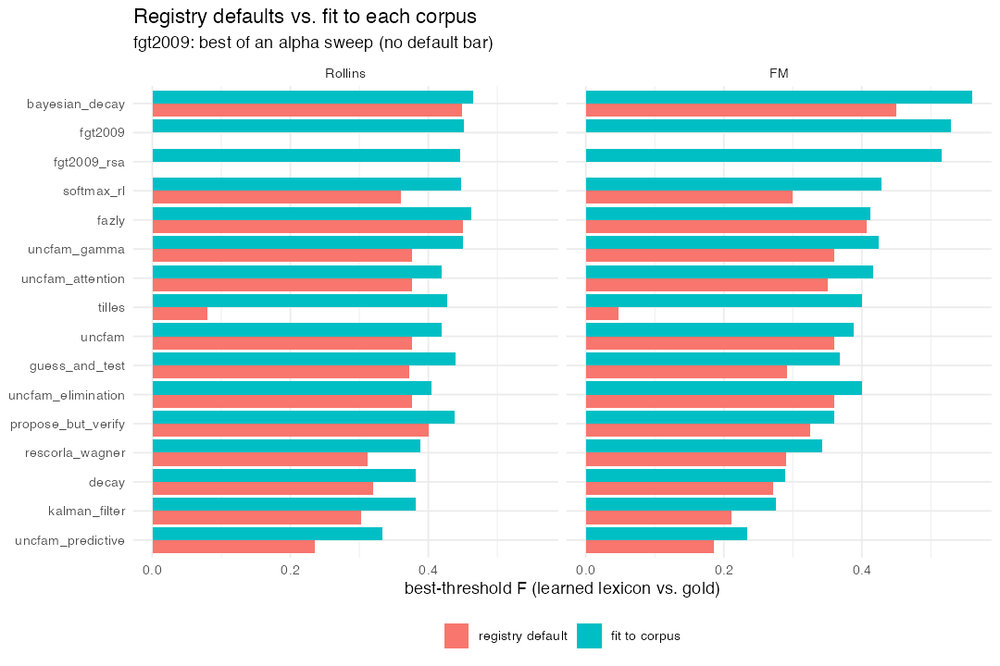

Cross-situational models on naturalistic corpora
================
2026-10-03

- [The corpora](#the-corpora)
- [Method](#method)
- [Results](#results)
- [Findings](#findings)
- [Caveats](#caveats)
- [Reproducing](#reproducing)

A short write-up of how the models in **XSLmodels** do at recovering a
gold-standard lexicon from two naturalistic corpora of caregiver speech,
at their default parameters and fit to each corpus. Produced from
`corpus_gold_comparison.R` and `corpus_gold_fits.R` in this directory.

## The corpora

| corpus | source | utterances | word types | object types | gold pairs |
|----|----|---:|---:|---:|---:|
| **`rollins_corpus`** | CHILDES/Rollins – the corpus Frank, Goodman & Tenenbaum (2009) fit | 619 | 416 | 22 | 34 |
| **`fm_corpus`** | Frank, Tenenbaum & Fernald (2013) | 4763 | 1122 | 30 | 41 (curated) |

Neither has human referent-selection data, so models are scored against
the gold lexicon rather than by SSE against accuracy. The score is the
**best-threshold F** of the (row-normalized) learned word-object matrix
against the gold lexicon, sweeping the threshold (`get_roc_max()`).

## Method

- **Default run** (`corpus_gold_comparison.R`): every model once per
  corpus at its `xsl_model_registry()` starting parameters; `fgt2009()`
  / `fgt2009_rsa()` at `gamma = 0.1`, `kappa = 0.05` with `alpha` from
  the heuristic `round(7 sqrt(n / 600))`.
- **Fitted run** (`corpus_gold_fits.R`): a parallel DEoptim search over
  each model’s parameters maximizing that same F; `fgt2009*` by an
  `alpha` sweep. `baseline` has no parameters; `uncfam_sampling`,
  `multi_sampling` and `pursuit`, `minerva2` and `todam` are left at
  defaults (their per-simulation cost on FM makes a DEoptim search
  impractical). `rem` is omitted entirely: at ~11 min per simulation on
  FM, even the default run isn’t practical.

## Results

| model | Rollins (default) | Rollins (best) | FM (default) | FM (best) | overall best |
|:---|---:|---:|---:|---:|---:|
| bayesian_decay | 0.449 | 0.465 | 0.450 | 0.560 | 0.512 |
| fgt2009 | NA | 0.452 | NA | 0.529 | 0.491 |
| fgt2009_rsa | NA | 0.447 | NA | 0.515 | 0.481 |
| softmax_rl | 0.360 | 0.447 | 0.299 | 0.429 | 0.438 |
| fazly | 0.450 | 0.463 | 0.407 | 0.412 | 0.438 |
| uncfam_gamma | 0.377 | 0.450 | 0.360 | 0.425 | 0.438 |
| uncfam_attention | 0.377 | 0.420 | 0.351 | 0.417 | 0.418 |
| tilles | 0.080 | 0.427 | 0.048 | 0.400 | 0.414 |
| uncfam | 0.377 | 0.420 | 0.360 | 0.388 | 0.404 |
| guess_and_test | 0.372 | 0.440 | 0.292 | 0.368 | 0.404 |
| uncfam_elimination | 0.377 | 0.404 | 0.360 | 0.400 | 0.402 |
| propose_but_verify | 0.400 | 0.438 | 0.325 | 0.360 | 0.399 |
| uncfam_sampling | 0.394 | 0.394 | 0.360 | 0.360 | 0.377 |
| multi_sampling | 0.394 | 0.394 | 0.352 | 0.352 | 0.373 |
| rescorla_wagner | 0.312 | 0.389 | 0.290 | 0.343 | 0.366 |
| pursuit | 0.400 | 0.400 | 0.307 | 0.307 | 0.353 |
| decay | 0.320 | 0.382 | 0.272 | 0.288 | 0.335 |
| kalman_filter | 0.303 | 0.382 | 0.211 | 0.275 | 0.328 |
| baseline | 0.377 | 0.377 | 0.268 | 0.268 | 0.323 |
| minerva2 | 0.359 | 0.359 | 0.267 | 0.267 | 0.313 |
| uncfam_predictive | 0.235 | 0.333 | 0.185 | 0.233 | 0.283 |
| todam | 0.174 | 0.174 | 0.048 | 0.048 | 0.111 |

Best-threshold F, models ordered by overall best (mean of the two
corpora’s best F). “best” is the fit-to-corpus value where a fit was
run, otherwise the default.

<figure>

<figcaption aria-hidden="true">Registry defaults vs. fit to each
corpus</figcaption>
</figure>

## Findings

1.  **`bayesian_decay` is the strongest model on both corpora** (overall
    best F = 0.51), and `fgt2009` – the model designed for this problem
    – is next. The gap to the associative baselines (`baseline`,
    `decay`, `rescorla_wagner`) is real but not huge: ~0.5 vs
    ~0.32–0.37.

2.  **`fgt2009` buys precision with the size prior.** At default
    parameters on FM its precision is 0.71 against 0.15–0.34 for the
    others (recall 0.3): the geometric `exp(-alpha |L|)` prior makes it
    commit to a small, mostly-correct lexicon rather than a large noisy
    one.

3.  **The RSA layer is a no-op here.** `fgt2009_rsa` tracks `fgt2009` to
    within noise (fitted F 0.45 / 0.52 vs 0.45 / 0.53). The learned
    lexicon is too sparse for a word to name two co-present objects, so
    the pragmatic speaker reduces to the literal one.

4.  **Fitting matters – most for the models whose registry defaults were
    tuned on controlled experiments.** `tilles` gains +0.35 on both
    corpora (Rollins / FM), `softmax_rl` +0.09 / +0.13,
    `uncfam_predictive` +0.10 / +0.05. `fazly` barely moves – its
    defaults were already near-optimal for a corpus.

5.  **At default parameters, the `uncfam` family and its sampling
    versions land in the same place** (F ~0.35–0.38 on both corpora) –
    the expected sanity check, since the sampling models are meant to
    approximate `uncfam()`. Fitting then lifts the deterministic
    `uncfam` variants to ~0.40–0.45 (`uncfam_gamma` best, at 0.45 /
    0.43) while `uncfam_sampling` / `multi_sampling` stay at their
    defaults (not fit here).

6.  **The hypothesis-testing models do relatively better on Rollins.**
    At defaults, `propose_but_verify`, `pursuit` and `guess_and_test`
    score ~0.40 on Rollins (above the `uncfam` family) but only
    ~0.30–0.32 on FM. (Earlier versions of this report had `pursuit`
    collapsing on FM; that was a bug in its handling of single-object
    utterances, fixed in 0.4.0.)

7.  **`tilles` and `todam` learn diffuse lexicons at defaults** (F \<
    0.2, best threshold 0: nothing separates correct pairings from the
    rest). Fitting rescues `tilles` (above); `todam` was not fit.

## Caveats

- **Not human data.** F against a gold lexicon measures lexicon
  *recovery*, not fit to what a child actually learns; the two can
  diverge (a model can be “too good”).
- **F depends on the gold lexicon.** FM ships three (`curated`,
  `strict`, `permissive`); absolute F is not comparable across them. All
  numbers here use `curated`.
- **The sampling models are only partly fit.** `propose_but_verify`,
  `guess_and_test` and `softmax_rl` are fit with 60 simulations averaged
  per DEoptim evaluation; `uncfam_sampling` / `multi_sampling` /
  `pursuit` / `minerva2` / `todam` are at defaults, and `rem` is not
  run.
- **`kalman_filter`’s `sigma2_obs` is not identified.** The three
  parameters share a scale redundancy and the F landscape plateaus, so
  its fitted `sigma2_obs` sits at whatever bound it is given without
  changing F. Read it as “large”.
- Several models needed bug fixes before they would run on a corpus at
  all (memory, non-referential utterances with no objects present,
  position- vs-label confusions in `softmax_rl` / `guess_and_test` /
  `tilles`, and single-object utterances in `propose_but_verify` /
  `pursuit`); see the package NEWS.

## Reproducing

``` r
# from the package root, against the installed package
source("tests/bakeoff_comparison/corpus_gold_comparison.R")   # ~30 min
source("tests/bakeoff_comparison/corpus_gold_fits.R")         # ~3 h (parallel)
rmarkdown::render("tests/bakeoff_comparison/corpus_report.Rmd")
```
